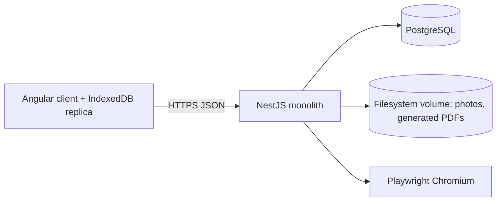

# QLGX Offline-First Web Application — Implementation Plan

> **For agentic workers:** REQUIRED SUB-SKILL: Use `superpowers:subagent-driven-development` (recommended) or `superpowers:executing-plans` to implement this plan task-by-task. Steps use checkbox (`- [ ]`) syntax for tracking.

**Goal:** Replace the QLGX Windows desktop application with an offline-first web application for one parish, preserving verified business behavior, the report layouts actually in use, and all existing data.

**Architecture:** A TypeScript modular monolith — an Angular client holding a full local replica of the parish database in IndexedDB, and a NestJS API over PostgreSQL. The client works fully offline for read and write; a sequence-based sync protocol reconciles the two. Business rules live in a framework-free shared package so the same code validates offline in the browser and online in the API. Data arrives once through a re-runnable importer that reads the legacy Access file.

**Tech Stack:** Angular, Node.js LTS, NestJS, TypeScript (strict), PostgreSQL, Drizzle ORM with explicit SQL migrations, OpenAPI, Playwright, Vitest, and Playwright Chromium for server-side PDF rendering.

## Global Constraints

- **Offline-first is a core requirement, not a later phase.** Every design decision that affects sync is made before feature work begins (§4.4, §5.1).
- **One parish. No multi-tenancy.** Rows carry `parish_id` for future optionality, but no row-level security, no tenant-context plumbing, and no cross-tenant test harness.
- **No user migration programme.** Existing desktop installations at other parishes are out of scope and stay on 3.3.7. This plan serves one parish.
- **Parish scale, not corporate scale:** fewer than ten users, fewer than ten thousand people records. Reject any design whose only justification is scale.
- **Business rules and *use flows* are preserved; Microsoft implementation technology is not.** No Janus, no Office automation, no OLE DB, no legacy auto-updater — but screen sequences, field order, and keyboard shortcuts follow the desktop application so staff do not have to relearn their job (§3.3).
- **Data outlives the stack.** Every technology choice is either long-lived or has a proven, tested path to get the data out (§4.6). UI frameworks may churn; the data layer may not.
- **Sacramental records are canonical documents.** Correctness of dates, names, and printed output outranks velocity. Never silently discard or invent a value.
- **Reports are online-only.** Printing requires a printer, which means being at the parish office.
- Recreate the report layouts currently in use before considering user-editable templates.
- Reports produce complete or partially completed PDFs suitable for paper signature, plus CSV, JSON, and XLSX exports.
- Never commit passwords, keys, tokens, parish databases, production exports, photos, or `.env` files.
- Production parish data must never be used in automated tests, screenshots, fixtures, or AI/tool consultations.

---

## 0. Blocking Prerequisites

Work that cannot start until these exist. Nothing in Phase 0 beyond `.gitignore` and the inventory cards is meaningful without them.

### 0.1 A real parish database — required by week 2

Obtain, under restricted access, from a live installation:

1. **`giaoxu.mdb`** — the actual parish file, not the blank seed at `Source/ChuongTrinh/Resources/giaoxu.mdb`. The seed has schema but zero rows, so it cannot answer any of the questions Phase 0 exists to answer.
2. **The photo files.** `AnhDaiDien` stores a *relative path*, not a blob (§2.4). Copy the whole install directory tree, or every photo silently breaks on import.
3. **`CauHinh` contents as configured** — which of the 33 `CF_*` keys that parish actually sets, including `TEMPLATE_FOLDER` and `REPORT_LANGUAGE`.
4. **The `Template/` folder as deployed**, in case it was customized on site.

Without real rows there is no encoding classification (DBI-003), no date-precision profile (DBI-004), no photo audit (DBI-005), and no partial-date corpus (PDT-001) — which means the domain kernel, the importer, and the report view models are all guesswork.

**Handling rules:** restricted storage only, never committed, never used in tests, screenshots, fixtures, or AI/tool consultations. All fixtures derived from it are synthetic or sanitized. Record the copy's provenance and checksum, and delete it on program completion.

If a live parish copy genuinely cannot be obtained, that is a **stop-and-replan** condition, not something to work around with the seed file.

A temporary delay is different. While access is being arranged, execute the bounded pre-data sprint in §0.4. It prepares repository-derived evidence and the secure intake path, but it does not relax any real-data gate or move the Phase 1 start date forward.

### 0.2 Pilot parish and diocese — required before RPI-001

Determines which diocese override templates enter scope (§7.1) and whose workflows are authoritative when practice differs.

### 0.3 Named domain expert — required before Gate 0

A parish secretary or administrator who does this work daily. Four hours per week, eight during sacrament and marriage discovery. Without a named person with reserved time, the characterization cards produce guesses that look like specifications.

### 0.4 Pre-data sprint — useful work while the real `.mdb` is delayed

This is a **maximum ten-working-day preparation window**, not a substitute for the §0 prerequisites. It uses only repository evidence: solution and project files, legacy source, `VersionConfig.xml`, git history, the blank schema seed, and the checked-in report templates. The sprint ends sooner if the real data package arrives.

This section is an execution queue for after the repository leaves its current planning-only phase. While that restriction remains active, no card below is executed and no artifact other than this master plan is created or changed.

**Security checkpoint resolved (2026-07-29):** commit `77f85ed` adds the root and JetBrains ignore rules. `git check-ignore --no-index` now confirms that `.env`, `.env.*`, Access files, restricted data/install directories, migration work, photos, generated output, Node/Angular artifacts, and project-local C# build output are ignored. `.env.example`, `.idea/.gitignore`, root `BIN/`, and root `Release/` remain visible. SEC-001 is complete.

The preparation work is sliced from existing Phase 0 cards, so it adds no backlog IDs and no engineer-day estimate. A card may be closed only when its existing evidence column is satisfied. Where the evidence requires real rows, the pilot parish, or domain-expert approval, the output remains visibly marked `PROVISIONAL`.

| Sequence | Existing cards | Work permitted before real data | Evidence prepared now | Completion boundary |
|---:|---|---|---|---|
| 1 | SEC-001–003 | Define ignore coverage, restricted-data handling, secret checks, and retirement decisions for legacy network behavior | Synthetic ignore/secret cases; repository endpoint inventory; data-intake checklist naming `.mdb`, photos, `CauHinh`, deployed templates, provenance, checksum, owner, retention, and deletion date | These cards may close without production data if their evidence checks pass; never record the Access password in an artifact |
| 2 | LEG-001 | Classify every solution project, entry point, runtime dependency, generated area, and bundled sample/third-party area | Reviewed repository-only baseline with exact paths | May close after peer review because its source of truth is the repository |
| 3 | LEG-002–006 | Build static catalogs of forms, commands, SQL, validation branches, global-state reads, report calls, and navigation entry points | Per-module inventory with a source path and symbol for every claim; unanswered behavior questions listed separately | Keep `PROVISIONAL`; code shows possible paths, not which paths the parish uses or what staff intend |
| 4 | BUG-001–002 | Translate the 116 `Source/ChuongTrinh/VersionConfig.xml` entries and mine behavioral fixes from git history | One traceable row per changelog entry and relevant commit; duplicates linked, not discarded | BUG-001/002 may close after traceability review; no row becomes “still required” until BUG-003 domain review |
| 5 | FLO-001–004 | Draft screen sequences, field order, defaults, validation timing, shortcuts, and the `Source/ChuongTrinh/frmMain.cs` route map from static evidence | Flow diagrams or tables with source links and explicit observation questions | Keep `PROVISIONAL`; only a domain-expert walkthrough can approve the flow or resolve intent |
| 6 | RPI-001–003 preparation | Inventory all 63 files under `BIN/Template/`, group variants by logical report, and record inspectable paper/font/field/signature properties | Candidate catalog with checksums, folder, format, logical report name, duplicate/variant relationship, and inspection limitations | Do not close RPI-001 until the pilot diocese defines the in-scope set; do not close RPI-002/003 without deployed-template comparison and approval |
| 7 | DBI-001 preparation | Extract a **schema hypothesis only** from `Source/ChuongTrinh/Resources/giaoxu.mdb` and reconcile it with `GxConstants.cs`, `UpdateProcess.cs`, and SQL references | Candidate table/column/type/index list plus a “verify against live file” column | Do not close DBI-001; the blank seed may be older than or differ from the live installation |
| 8 | DBI-002–005 preparation | Finalize profiler questions, neutral output contracts, redaction rules, and synthetic edge-case designs | Executable-check specification for null/blank/range, encoding class, date precision, and photo paths | Do not run against invented rows and do not close any DBI-002–005 card |

#### Pre-data sprint task order

Each step must be independently reviewable. Do not bundle several unfinished catalogs into one large draft.

1. **Day 1 — secure intake plan.** Specify who may copy and access the package, where the restricted working copy lives, how its checksum and provenance are recorded, how photos and deployed templates remain associated with the `.mdb`, and when every copy is deleted. Include a dry run using fake filenames and a synthetic secret only.
2. **Day 2 — repository baseline.** Finish the LEG-001 evidence map. Record file encodings and the command required to read UTF-16 source so later inventory work does not silently omit files.
3. **Days 3–4 — rule register.** Complete BUG-001 before BUG-002. Preserve the original Vietnamese text, add an English explanation, cite the version or commit, name the affected module, and leave the current-policy decision for BUG-003.
4. **Days 5–6 — static module catalogs.** Draft LEG-002–006 in separate module slices. For each behavior record the form or class, trigger, inputs, validation, SQL or helper call, state mutation, output/report, and unresolved question.
5. **Days 7–8 — flow drafts.** Turn the catalogs into FLO-001–004 walkthrough scripts. Questions must be answerable by observing or interviewing a parish operator; avoid questions that ask them to design the replacement.
6. **Day 9 — report candidates.** Catalog every checked-in template and identify exact duplicates versus diocesan/layout variants. Record that the deployed folder is authoritative when it arrives.
7. **Day 10 — readiness review.** Check traceability, split oversized follow-up work, assemble the domain-expert interview agenda, and publish a blocked/ready table. Do not pass Gate 0.

#### Claims forbidden before data arrival

- Do not infer field nullability, encoding frequency, date precision, orphan counts, duplicate rates, configured settings, or photo availability from the blank seed.
- Do not promote a schema hypothesis into PostgreSQL migrations or domain types.
- Do not create “representative” fixtures by guessing what production records look like.
- Do not choose final report scope from the repository folders alone.
- Do not mark a flow approved because it matches source code; legacy code can encode obsolete behavior or a historical defect.
- Do not scaffold the application, importer, sync layer, domain kernel, or report renderer merely to keep engineering busy. Those choices become expensive to undo when real evidence arrives.

#### Data-arrival handoff

Call the day the complete restricted package is accepted **Data Day D0**. The package is complete only when the `.mdb`, referenced photo tree, configured `CauHinh` values, deployed `Template/` folder, provenance, and named custodian are present.

| Target | Action | Exit evidence |
|---|---|---|
| D0 | Verify authorization, package completeness, checksum, read-only source handling, access list, retention date, and deletion owner | Intake record complete; no production artifact enters git, screenshots, fixtures, or AI/tool consultations |
| D0–D1 | Run DBI-001 against the live file and compare it with the seed hypothesis | Every schema difference classified; DBI-001 evidence passes |
| D1–D2 | Run DBI-002, then DBI-003–005 against the restricted copy | Sanitized aggregate summary produced; ambiguous encodings/dates and missing photos counted without exposing records |
| D2–D3 | Create only synthetic or irreversibly sanitized corpora from the observed **classes**, then have a second person review re-identification risk | PDT-001/encoding fixture inputs contain no parish or person data |
| D3–D4 | Reconcile provisional LEG/FLO/RPI work with observed configuration, deployed templates, and the first domain-expert session | Differences recorded; drafts remain provisional until their backlog evidence passes |
| D5 | Re-estimate affected cards and hold Gate 0 readiness review | Blocked cards, changed assumptions, owners, and next dates recorded; Gate 0 passes only if every §10 condition is met |

If the package has no credible delivery date when the ten-day sprint ends, pause application work. Decide whether to keep pursuing the parish data, reduce the project to a repository-characterization exercise, or formally re-plan a new product that makes no migration/parity promise.

---

## 1. Decision and Estimate

This is a product rewrite with a one-time data import, not a code conversion. The legacy application is small in concurrency but broad in domain: people, households, parish hierarchy, sacraments, marriage and banns, transfers, catechism, associations, vocations, statistics, imports, and reports.

The real risks are:

1. Business rules hidden inside forms, global `Memory` state, and embedded SQL.
2. Access data with no declared foreign keys, text-formatted dates, and **mixed Vietnamese font encodings**.
3. Partial dates whose precision may be year, month, or exact day.
4. Report layouts that encode diocesan practice and must survive on paper.
5. Offline sync correctness — the one genuinely hard piece of engineering here.

### Honest estimate

The estimate below is reconciled with the phase table in §10; earlier drafts of this plan contained a summary figure that contradicted it.

| Team | Usable core (people, households, sacraments, core reports, offline read) | Full parity |
|---|---|---|
| Three experienced engineers + available domain expert | 8–11 months | 14–18 months |
| One primary developer | 20–30 months | 30–40 months |

"Usable core" means a parish secretary can do daily work and print the certificates they need. A parish register that cannot print a baptism certificate is not usable, so no phase before reports counts as a release.

The backlog in §11 is roughly 250 cards totalling **about 210 engineer-days of coding**. Multiply by **3 for a solo developer** and **4–5 for a team** — the difference is coordination, cross-review, and integration, not talent. That gives 600 days solo and 800–1000 days for a team, which is where the calendar figures above come from. The two numbers are not independent; if you change one, recompute the other.

**Note on what offline costs.** This revision removed a large amount of scale-driven ceremony — multi-tenancy and row-level security, a separate worker deployment, object storage, and 39 out-of-scope report templates — worth roughly 55 engineer-days. It then added the offline sync layer (§11.4), encoding conversion, and photo handling, worth roughly 20 days of cards but carrying the majority of the project's technical risk. Net backlog fell only from ~237 to ~200 days. **Offline-first costs about as much as everything else that was cut.** That is the honest trade, and it is worth making deliberately rather than discovering later.

A parish secretary who understands current workflows is a required project role. Reserve four hours per week during discovery and acceptance, and eight during sacrament and marriage discovery.

## 2. Verified Legacy Baseline

Every fact in this section was checked against the repository. Line references are to the current tree.

### 2.1 Application

- C# WinForms, .NET Framework 2.0, x86. Primary solution `Source/GiaoXu - VS2015.sln` (identical to `Source/GiaoXu.sln`).
- 378 `.cs` files, 234 excluding generated `.Designer.cs`. Seven projects: `ChuongTrinh` (`GiaoXu.exe`), `DBAccess` (`GXGlobal`), `GXControl`, `ExcelReport`, `Giaoly`, `AutoUpdate`, `ConvertFont` (`vnConvert`).
- `Source/AutoCompleteTextBox`, `Source/TabStrip_src`, and `Source/GxTranslation` are not in the solution — bundled third-party, sample, and stub code.
- No automated test suite, no CI.
- **Roughly half the `.cs` files are UTF-16 LE**, mixed with ASCII and UTF-8-BOM within the same directory. Read them with `iconv -f UTF-16 -t UTF-8`. See `CLAUDE.md`.

### 2.2 Coupling

SQL, validation, transactions, UI behavior, and reporting are mixed throughout: hundreds of raw SQL literals, and references to the global `Memory` singleton across most of the codebase. No existing project becomes a production service. The old application is a behavioral reference and the import source.

### 2.3 Database

`giaoxu.mdb`, Jet/ACE, password-protected with a credential hardcoded in `Source/DBAccess/GxConstants.cs`. A blank seed copy is embedded at `Source/ChuongTrinh/Resources/giaoxu.mdb` and extracted on first run.

Tables with declared constants in `GxConstants.cs`:

**Domain tables (import these):** `GiaoPhan`, `GiaoHat`, `GiaoXu`, `GiaoHo`, `LinhMuc`, `GiaoDan`, `GiaDinh`, `ThanhVienGiaDinh`, `DotBiTich`, `BiTichChiTiet`, `HonPhoi`, `GiaoDanHonPhoi`, `RaoHonPhoi`, `ChuyenXu`, `HoiDoan`, `ChiTietHoiDoan`, `TanHien`, `TaiKhoan`, `CauHinh`, `DuLieuChung`, `GiaoXuNhan`.

**Catechism tables (referenced in SQL, not in `GxConstants`):** `ChiTietLopGiaoLy`, `GiaoLyVien`, plus `KhoiGiaoLy` and `LopGiaoLy`.

**Do not import — report scratch space:** `ReportGiaoDan`, `ReportHonPhoi`, `ReportRaoHonPhoi`, `ReportBiTich`, `ReportChungNhanHP`, `ReportSoGiaDinh`, `RaoHonPhoiTMP`. These are populated during report generation and hold no canonical data.

**Correction to earlier drafts:** `VaiTro` is **not a table**. It is an integer column on `ThanhVienGiaDinh` with three hardcoded values in `GxConstants.cs`: `VAITRO_CHONG = 0`, `VAITRO_VO = 1`, `VAITRO_CON = 2`. There is no relationship-type lookup table to migrate; the target enum is authored, not imported.

The `GiaoDan` table combines identity, contact, status, family, and sacramental attributes. This denormalization is not copied forward.

### 2.4 Three legacy data hazards

These are the facts that will break a naive importer.

**Mixed Vietnamese font encodings.** `Source/DBAccess/CMemory.cs:570` detects VNI-encoded text on input and converts it to Unicode; line 1111 converts TCVN3/UTH; line 1463 strips diacritics. The whole `vnConvert` project exists for this. Rows written across 15+ years and many desktop versions are in *different* encodings, potentially within one table. An importer that assumes Unicode will silently mangle names and produce garbage certificates.

**Partial dates.** Dates are stored and manipulated as day/month/year string parts, not `DateTime` — see `GetDateFromString`, `GetDatePart`, `SplitDatePart`, `GetIntOfDateFrom`/`GetIntOfDateTo` in `CMemory.cs`. A sacrament may be known only to the year. Precision is information and must survive.

**Photos are file paths, not blobs.** `AnhDaiDien` is `Text(255)` on both `GiaoDan` and `GiaDinh` (added by `UpdateProcess.cs:789,793`), resolved against the install directory at `frmGiaoDan.cs:1119` and `frmGiaDinh.cs:1573`. Extracting the `.mdb` alone breaks every photo. The importer must collect the referenced files from the install directory.

### 2.5 Reports

`BIN/Template/` holds 63 files (59 `.doc`, 3 `.xls`, 1 `.docx`) across seven folders: `Chung` 19, `TP HCM A4` 14, `TP HCM` 8, `Phan Thiet` 7, `Vinh` 7, `BMT` 4, `Xuan Loc` 4. Only 27 distinct filenames exist; the diocese folders are variant overrides.

**A single installation uses `Chung` plus at most one diocese folder**, selected by the `TEMPLATE_FOLDER` setting in `frmOption.cs`. This plan converts the 19 `Chung` templates plus the pilot parish's diocese overrides — not all 63.

**Reports have a language dimension.** `GxConstants.cs` defines `CF_LANGUAGE = "REPORT_LANGUAGE"` with `LANG_VN = "vi-vn"` and `LANG_EN = "en-us"`; `GetHoTenByLang` and `GetDateStringByLang` have 14 call sites. Name order and date formatting change with language. The template registry is keyed by report **and language**.

### 2.6 Fifteen years of recorded fixes — the most undervalued asset here

The desktop application is obsolete as a platform, but it is the only written record of what this parish's work actually requires. Two sources encode that knowledge:

**`Source/ChuongTrinh/VersionConfig.xml` contains 116 discrete changelog entries** across 11 releases (3.1 → 3.3.7), in Vietnamese, each describing a bug fixed or a rule clarified. These are not release notes — they are **business rules discovered the hard way, usually after a parish secretary produced a wrong document**. Examples from the file:

- Marking a person deceased must flip the surviving spouse back to single status.
- A person may be the husband or wife of exactly one household, unless the previous household is archived.
- Household member counts exclude transferred, deceased, and members who have formed their own household.
- The family sheet must print eight member rows even when the household has fewer.
- Marriage requires age > 14; ages under 18 warn but do not block.
- Baptism date entered without a saint's name must be rejected.

**Git history holds 99 commits (2018–2024)**, whose messages name the workflows that broke and were repaired.

Every one of these is a characterization test waiting to be written, and every one represents a real user who was let down once. Reimplementing without mining them means rediscovering all 116 in production. Cards `BUG-001`–`BUG-004` (§11.2) convert both sources into an executable regression corpus **before** the corresponding module is built.

### 2.7 Navigation surface and muscle memory

`frmMain` exposes **30 top-level entry points**, opened as tabs rather than child windows (`ShowForm`). The full list is in `frmMain.cs`; it is the de-facto sitemap of the new application.

Keyboard shortcuts are defined once and used across every screen — `frmBase.cs:14-15` and `GXAddEdit.cs:344-346`:

| Key | Action |
|---|---|
| F2 | New / add |
| F3 | Delete |
| F4 | Edit |
| F6 | Save / update |
| F11 | Close |
| F1 | Context help |

Parish staff have used these for years. **They are preserved verbatim in the web application** (§3.3). Browsers reserve some function keys, so where a conflict exists, document it and provide the closest equivalent — do not silently invent a new scheme.

### 2.8 Network behavior to retire

- `UpdateProcess.cs:2188` `sendGiaoXuInfo()` posts parish name, address, phone, email, website, the priest's name/phone/email, and household and parishioner counts to `themgiaoxu.aspx`. Undisclosed telemetry. Do not port.
- `GxCheckVersion.cs` downloads `version.txt` and reflects into `AutoUpdate.exe`. Replaced by ordinary deployment.
- `frmGopY` feedback submission. Do not port.

## 3. Scope

### 3.1 First production scope

- Staff authentication and roles.
- Parish hierarchy (diocese, deanery, parish, parish section) and clergy reference data.
- People, households, membership roles, status and history, search, duplicate review.
- Sacrament batches and records.
- Marriage, participants, and banns.
- Transfers, archive and status transitions, associations, vocations, catechism.
- The statistics currently produced by `frmThongKeChung`.
- PDF reports for the in-use template set; CSV/JSON/XLSX exports.
- **Full offline operation**: complete local replica, offline read and write, sync with conflict inbox.
- Audit trail, backups with a tested restore, and the Access importer.

### 3.2 Explicit non-goals

- Automatic translation of C# or WinForms screens into web code.
- Reuse of Janus, Office automation, OLE DB, or the legacy updater.
- Multi-tenancy, row-level security, or diocese administration.
- Onboarding other parishes or migrating existing desktop installations.
- Microservices, Kubernetes, event sourcing, Redis, separate search cluster, or a separate worker deployment.
- Public self-registration or public access to parishioner records.
- Full mobile-first redesign. Desktop browsers are the first-class client.
- CRDTs or operational transforms. See §4.4 for why they are not needed here.
- Offline report rendering.
- End-user report-template editing in the initial release.
- A finance module. Legacy `TaiKhoan` means application accounts, not financial accounts.

### 3.3 Workflow fidelity — a requirement, not a preference

The desktop platform is obsolete; the workflows on it are not. Staff should be able to move to the web application without retraining. Concretely:

- **Screen sequence matches.** If the desktop requires selecting a parish section before listing people, the web application does too. Do not "improve" a flow during conversion — capture it, ship it, and change it later with the domain expert's agreement and a recorded reason.
- **Field order and grouping match** the legacy form within each screen.
- **Keyboard shortcuts are preserved verbatim** (§2.7). Data entry here is keyboard-heavy and high-volume; a mouse-first redesign is a regression regardless of how modern it looks.
- **Vocabulary matches.** Screen labels use the same Vietnamese terms as the desktop — `Giáo dân`, `Gia đình`, `Bí tích`, `Hôn phối`, `Giáo họ`. Do not translate, modernize, or "clarify" domain vocabulary.
- **The 30 entry points in §2.7 map to routes**, so a user who knows where a function lives still knows.

Every UI card in §11 is accepted against the flow map produced by `FLO-001`–`FLO-003`, not against a designer's judgment. Deviations are allowed but must be listed in `docs/architecture/flow-deviations.md` with a reason and the domain expert's approval.

Modernization applies to *technology and ergonomics* — responsiveness, search, validation feedback, undo, offline — not to the shape of the work.

## 4. Locked Architecture Decisions

These decisions are made now because they are expensive to reverse. An implementer may not change them without an explicit decision record.

### 4.1 Runtime topology



- **One process.** No separate worker deployment. Report rendering, imports, and exports run in the API process behind a concurrency limiter (default 2). At fewer than ten users this is correct, not a compromise.
- **Filesystem volume, not object storage.** Photos and generated PDFs live on a backed-up volume. Legacy photos are already loose files.
- **Managed PostgreSQL** where available, with daily encrypted backups and point-in-time recovery.
- **Reverse proxy** for TLS, request-size limits, security headers, and login rate limiting.

### 4.2 Monorepo structure

```text
apps/
  web/                    Angular client, offline-capable
  api/                    NestJS HTTP API, jobs, sync endpoints
packages/
  domain/                 Framework-free rules, value objects, validation
  contracts/              OpenAPI types and generated client
  database/               Drizzle schema, SQL migrations, repositories
  report-engine/          Report contracts and PDF pipeline
  report-templates/       Versioned HTML/CSS templates and print assets
  importer/               Access extraction, transform, load, verify
  testing/                Synthetic factories and helpers
infra/
  compose/                Local PostgreSQL for development and tests
  deployment/             Container and deployment definitions
docs/
  architecture/           Decision records, data dictionary
  reports/                Template catalog and fidelity sign-offs
  migration/              Field mapping and importer runbook
```

### 4.3 Module boundaries

Each API module owns its tables and repositories. A module may call another only through an exported application service; it may never import another module's repository. Modules: Identity, Organization, People, Households, Clergy, Sacraments, Marriage, Transfers, Associations, Vocations, Catechism, Reporting, ImportExport, Audit, Sync.

`Person` is a narrow shared concept. **No module adds columns to `people`.** Sacraments, catechism, vocations, and associations own their own tables and reference `people` by id.

### 4.4 Offline sync protocol

This is the heart of the plan. It is defined completely here so no feature task has to invent it.

**Why not CRDTs.** Gmail syncs an unbounded mailbox with untrusted concurrency. A parish register is a bounded dataset with fewer than ten writers who almost never edit the same record on the same day. Last-write-wins with a conflict inbox is correct for this workload and is perhaps a tenth of the work. Nothing is lost, because the overwritten value is preserved in both the audit trail and the conflict record.

**The change log.** Every mutation, in the same transaction as the data write, appends one row:

```sql
create table sync_changes (
  seq         bigserial primary key,
  entity      text        not null,   -- e.g. 'people', 'sacrament_records'
  entity_id   uuid        not null,
  op          text        not null check (op in ('upsert', 'delete')),
  version     integer     not null,
  changed_at  timestamptz not null default now(),
  changed_by  uuid        not null references users(id)
);
create index sync_changes_seq_idx on sync_changes (seq);
```

A monotonic `bigserial` gives the client a single, gapless cursor with no clock dependency and no tiebreaker logic. Write amplification is irrelevant at this volume.

**Pull.** `GET /sync/changes?since=<seq>&limit=500` returns the current state of each changed row, not a history replay:

```ts
interface SyncPullResponse {
  cursor: string;                 // highest seq included; opaque to the client
  hasMore: boolean;
  changes: Array<{
    entity: string;
    id: string;
    op: 'upsert' | 'delete';
    version: number;
    data: Record<string, unknown> | null;   // null when op === 'delete'
  }>;
}
```

The client applies changes in `seq` order and stores the cursor. Because only current state is returned, a row edited fifty times while offline arrives once.

**Push.** `POST /sync/mutations` sends the queue in client order:

```ts
interface SyncMutation {
  idempotencyKey: string;   // UUIDv7, generated on the client, never reused
  entity: string;
  entityId: string;         // UUIDv7, generated on the client for creates
  op: 'upsert' | 'delete';
  baseVersion: number | null;   // null for a create
  payload: Record<string, unknown>;
  clientTimestamp: string;      // ISO 8601, advisory only — never trusted for ordering
}

interface SyncMutationResult {
  idempotencyKey: string;
  status: 'applied' | 'conflicted' | 'rejected';
  version: number | null;       // server version after apply
  conflictId: string | null;    // set when status === 'conflicted'
  errors: Array<{ field: string; code: string; message: string }>;  // when rejected
}
```

Rules, in order:

1. **Idempotency.** `idempotency_key` carries a unique index. A replayed mutation returns the original result and writes nothing.
2. **Validation.** The API calls the *same* `packages/domain` validator the client already ran. Failure returns `rejected` with field errors; the client surfaces them in a review queue and does not retry automatically.
3. **Apply.** If `baseVersion` matches the current row version, apply normally.
4. **Conflict.** If `baseVersion` is stale, **apply anyway** (the offline human is the authority on their own intent) and write a `sync_conflicts` row capturing the overwritten field values, both versions, and both actors. Return `conflicted` with the `conflictId`.
5. Everything above happens in one transaction per mutation, together with the `sync_changes` append and the audit event.

```sql
create table sync_conflicts (
  id                uuid primary key,
  entity            text        not null,
  entity_id         uuid        not null,
  overwritten_data  jsonb       not null,   -- redacted per §5.4
  overwritten_version integer   not null,
  overwritten_by    uuid        not null references users(id),
  applied_version   integer     not null,
  applied_by        uuid        not null references users(id),
  detected_at       timestamptz not null default now(),
  resolved_at       timestamptz,
  resolved_by       uuid references users(id),
  resolution_note   text
);
```

The conflict inbox is a normal screen: what changed, who lost, what the previous value was, restore or dismiss.

**What the client stores.** A full replica of every syncable entity in IndexedDB, keyed by entity and id, plus the mutation queue and the cursor. At parish volumes with no blobs this is a few megabytes.

**Photos are not replicated.** Metadata syncs; image bytes are fetched on demand and cached by the service worker. An uncached photo viewed offline shows a placeholder.

**Reports do not work offline.** The UI disables report actions when offline and says why.

**Bootstrap.** A first sync pulls from `seq = 0`. `sync_changes` is never pruned during the initial years; if it is later, pruning requires a full-resync flag for clients behind the pruned point.

### 4.5 Where business rules live

**Every business rule lives in `packages/domain` as a pure function with no framework imports.** The Angular client calls it before queueing a mutation; the API calls the same function before applying one. A NestJS service may orchestrate, authorize, and persist — it may **not** contain a domain rule.

This is the single most expensive decision to reverse, because rules written into API services cannot run offline. Enforce it with a lint boundary rule: `packages/domain` may not import from `@nestjs/*`, `apps/api`, or `apps/web`.

### 4.6 Technology longevity and the data exit path

The parish register is the asset. Frameworks are not. The governing rule is a separation:

> **Technology that holds the data must be durable. Technology that renders the UI may churn.**

Angular and NestJS will look dated in ten years and may be replaced. That is acceptable and expected — they hold no data. What holds data is chosen for permanence:

| Layer | Choice | Why it survives |
|---|---|---|
| Database | PostgreSQL | 30 years old, open source, no single owner, `pg_dump` produces complete portable SQL |
| Schema | **Explicit `.sql` migration files**, not ORM-generated-only | The schema is readable and reproducible without Drizzle, TypeScript, or Node |
| Photos and artifacts | Plain filesystem, human-meaningful paths | Readable with `ls`; no vendor id needed to interpret |
| Interchange | Versioned, self-describing JSON (§7.5) | Text, documented schema, no runtime required to read |
| Provenance | `legacy_key` on every imported row (§5.1) | Origin traceable back to Access forever |

**Disqualifying properties.** Any technology with these is rejected regardless of merit:

- Data in a proprietary store with no complete, documented export (Firestore, DynamoDB, vendor-only auth holding user records).
- Schema knowable only by running the ORM.
- A managed service where the data cannot be `pg_dump`'d out on demand.
- A file format requiring a specific vendor's software to read.

**The exit path is a tested feature, not a promise.** Cards `DAT-001`–`DAT-003`:

- `DAT-001` — a `system:export` command producing the entire parish — every table, every photo, the schema, and a README describing the format — as a dated directory of JSON and files.
- `DAT-002` — a `system:import` command that rebuilds an empty database from that export.
- `DAT-003` — **CI proves the round trip**: seed → export → wipe → import → the two databases hash identically. An export that has never been re-imported is a guess, exactly like an untested backup.

This runs on every pull request. The day it breaks, the data has become less portable than it was yesterday, and that is a defect like any other.

The same test is the answer to "what if this project is abandoned?" The export is complete, documented, and provably re-importable, so a future system in any language can consume it. That is the durable commitment — not the framework choice.

## 5. Data Design

### 5.1 Universal row shape

Every syncable table carries these columns. No exceptions — a table that skips them cannot sync, and retrofitting is a migration across the whole schema.

```sql
id          uuid        primary key,            -- UUIDv7, client- or server-generated
parish_id   uuid        not null references parishes(id),
version     integer     not null default 1,     -- bumped on every write
created_at  timestamptz not null default now(),
created_by  uuid        not null references users(id),
updated_at  timestamptz not null default now(),
updated_by  uuid        not null references users(id),
deleted_at  timestamptz,                        -- tombstone; sync sends op='delete'
legacy_key  text                                -- 'GiaoDan:1234', null for new records
```

- **UUIDv7 everywhere**, generated on the client for offline creates. Legacy integer keys are never reused as primary keys.
- `legacy_key` gives every imported row a traceable origin. Unique per `(entity, legacy_key)`.
- `deleted_at` is a **tombstone for sync**, not a business status. Business meaning — transferred, deceased, archived, excluded from statistics — lives in explicit status-history tables. A generic soft-delete is not a substitute.

### 5.2 Partial dates

A partial date is a domain value, not a malformed full date. One representation for birth, death, sacraments, marriage, transfers, and any imported uncertain date.

```ts
export type DatePrecision = 'year' | 'month' | 'day';

export interface PartialDate {
  year: number;
  month: number | null;
  day: number | null;
  precision: DatePrecision;
}
```

```sql
-- prefix per event, e.g. baptism_year, baptism_month, ...
event_year       smallint,
event_month      smallint,
event_day        smallint,
event_precision  text,
legacy_event_raw text,          -- the original string, always preserved
constraint event_date_shape check (
  (event_precision = 'year'  and event_year is not null and event_month is null and event_day is null) or
  (event_precision = 'month' and event_year is not null and event_month between 1 and 12 and event_day is null) or
  (event_precision = 'day'   and event_year is not null and event_month between 1 and 12 and event_day between 1 and 31) or
  (event_precision is null and event_year is null and event_month is null and event_day is null)
)
```

Rules:

- Application validation additionally rejects impossible calendar dates (31 February passes the CHECK, not the validator).
- Sorting uses year, then month with 0 for unknown, then day with 0 for unknown.
- Age calculation returns a **range** or `insufficient-precision`. It never substitutes day 1.
- `legacy_event_raw` is never dropped. It is the audit trail for the import.

### 5.3 People and households

Normalize the wide `GiaoDan` row into:

- `people` — name components, display name, sex, birth and death partial dates, notes.
- `person_contacts` — address, phone, email, with effective dates.
- `person_identifiers` — legacy recognition codes and civil identifiers, access-restricted.
- `person_status_history` — active, deceased, transferred, archived, virtual, excluded; effective date and reason.
- `households`, `household_memberships` — membership and relationship role with effective dates.
- Domain-owned tables for sacraments, marriages, associations, vocations, catechism.

`household_relationship_types` is an **authored** enum seeded from the three legacy constants (`VAITRO_CHONG`, `VAITRO_VO`, `VAITRO_CON`), extended as the domain expert requires. It is not imported.

Duplicate merging is never automatic. Detection proposes candidates from normalized Vietnamese names, partial dates, household, and identifiers; a user confirms every merge with a reason. Both legacy keys survive.

### 5.4 Audit and conflicts

- `audit_events` is append-only: actor, action, entity, request id, timestamp, reason, and redacted before/after JSON.
- The application database role may `insert` and `select` audit rows but not `update` or `delete` them.
- Audited: authentication, exports, report generation, imports, bulk edits, role changes, merges, and every sync mutation that conflicted.
- **Never** copied into audit or conflict JSON: password hashes, reset tokens, session ids, full civil identifiers.
- Hard deletion only through an approved retention workflow.

## 6. Legacy Mapping

A starting contract. Every field requires validation against real data before its transform is trusted.

| Access source | Target module | Target |
|---|---|---|
| `GiaoPhan` | Organization | `dioceses` |
| `GiaoHat` | Organization | `deaneries` |
| `GiaoXu` | Organization | `parishes` |
| `GiaoHo` | Organization | `parish_sections` |
| `GiaoXuNhan` | Organization | parish display/label settings, folded into `parish_settings` |
| `LinhMuc` | Clergy | `clergy_profiles`, `clergy_assignments` |
| `GiaoDan` | People | `people`, `person_contacts`, `person_identifiers`, `person_status_history` |
| `GiaDinh` | Households | `households`, household addresses |
| `ThanhVienGiaDinh` | Households | `household_memberships`; `VaiTro` int → authored `household_relationship_types` |
| `DotBiTich` | Sacraments | `sacrament_batches` |
| `BiTichChiTiet` | Sacraments | `sacrament_records`, participants, sponsors |
| `HonPhoi` | Marriage | `marriages` |
| `GiaoDanHonPhoi` | Marriage | `marriage_participants` |
| `RaoHonPhoi` | Marriage | `marriage_banns` |
| `ChuyenXu` | Transfers | `transfers`, `person_status_history` |
| `HoiDoan` | Associations | `associations` |
| `ChiTietHoiDoan` | Associations | `association_memberships` |
| `TanHien` | Vocations | `vocation_records`, vocation status history |
| `KhoiGiaoLy` | Catechism | `catechism_blocks` |
| `LopGiaoLy` | Catechism | `catechism_classes` |
| `ChiTietLopGiaoLy` | Catechism | `catechism_enrolments` |
| `GiaoLyVien` | Catechism | `catechist_assignments` |
| `TaiKhoan` | Identity | `users`; every account requires a forced password reset |
| `TenLoaiTaiKhoan` | Identity | reviewed mapping to `roles` |
| `CauHinh` | Organization | typed `parish_settings` (33 known `CF_*` keys); unknown keys retained in staging |
| `DuLieuChung` | Various | reviewed reference tables, not one generic dump |
| `AnhDaiDien` paths | People, Households | photo files copied from the install directory to the volume |
| `Report*`, `RaoHonPhoiTMP` | — | **not imported** (report scratch space) |

For every source field the mapping document records: source type, null and blank semantics, observed values, target field, transform, rejection rule, and the approving domain expert.

## 7. Reporting

### 7.1 Scope

Convert the 19 `Chung` templates plus the pilot parish's diocese overrides. The remaining diocese variants are out of scope (§3.2).

`Chung` set: `BiTich`, `ChungNhanHonPhoi`, `ChungNhan_GioiThieuHocGiaoLy`, `DanhSachRaoHonPhoi`, `GioiThieuChuyenXu`, `GioiThieuGiaoLyHonPhoi`, `GioiThieuRuaToi`, `GioiThieuThemSuc`, `HonPhoi`, `KQRaoHonPhoi`, `LyLichCaNhan`, `PhieuGiaDinh-A3`, `PhieuGiaDinh`, `RaoHonPhoi`, `RuaToi`, `SoGiaDinh`, `SoGiaDinh1`, `ThemSuc`, `XTRL`.

### 7.2 Registry shape

The legacy Office files are design references, not runtime templates. Base templates live at:

```text
packages/report-templates/src/<report-key>/<language>/<version>/
```

The `<language>` segment is required (`vi-vn`, `en-us`) — see §2.5. Template metadata and the enabled version live in PostgreSQL; an approved version is never edited in place.

### 7.3 Rendering

- Standard path: typed view model → escaped HTML template → print CSS → Playwright Chromium → PDF.
- Fallback: fixed-coordinate overlay on an approved PDF background, only where an approved prototype proves HTML cannot reach required fidelity.
- Partially completed forms omit selected values, render the lines, boxes, and signature areas, and label the output as incomplete.
- No server-side Word or Excel automation.
- Deterministic rendering: pinned Chromium, embedded Vietnamese fonts, fixed locale and timezone, recorded template version.

### 7.4 Prototype gate

Before mass conversion, prove five representative reports covering a list, a certificate, a letter, a complex fixed form, and a multi-page batch. Domain users compare **printed** output, not screen previews. Record approved deviations from the legacy Office output.

### 7.5 Exports

- CSV: UTF-8 with a BOM option for Vietnamese Excel; formula-injection characters escaped.
- JSON: versioned schema, ISO timestamps, structured partial dates, explicit nulls.
- XLSX: typed cells, stable column order, frozen headers, filters, date-precision labels, no macros.
- Export permissions and download events are audited.

## 8. Security and Operations

### 8.1 Legacy remediation

- The hardcoded Access credential appears in at least six tracked files: `Source/DBAccess/GxConstants.cs`, `Source/Giaoly/app.config`, `Source/Giaoly/Properties/Settings.settings`, `Source/Giaoly/Properties/Settings.Designer.cs`, `Source/ChuongTrinh/frmMergeData.cs`, `BIN/Giaoly.dll.config`.
- **Do not plan a rotation.** The credential is compiled into every deployed installation and every existing `.mdb` is encrypted with it; it cannot be changed without reissuing the desktop product. It also protects nothing — it guards a local file the user already owns. Record it as **accepted permanent legacy exposure**, keep it out of the new codebase, and move on.
- Add `.gitignore` rules for `.env*` (except `.env.example`), `*.mdb`, `*.accdb`, extracted data, generated PDFs and exports, photos, logs, and importer work directories **before the first implementation commit**.
- Do not port `sendGiaoXuInfo`, the auto-updater, or the feedback endpoint (§2.6).
- Archive one verified legacy installer and one database backup in restricted storage for rollback.

### 8.2 Authentication

- No public registration.
- Argon2id password hashing. Legacy hashes are never accepted as production credentials; every migrated account requires a reset.
- Server-side sessions in PostgreSQL, opaque random ids, `HttpOnly` / `Secure` / `SameSite=Lax` cookies, CSRF protection, rotation on login, revocation on password and role change.
- Rate-limit login and recovery. Recovery questions are not retained.
- **Two roles plus one:** `parish_admin` (everything), `operator` (daily data entry and reports), `read_only`. Permissions are explicit actions, never UI-menu visibility.
- MFA is not in the initial release, but the user model and login flow must not preclude it.

### 8.3 Offline security tradeoff — stated, not hidden

A full local replica means parishioner data sits in the browser profile of every staff device.

- Sign-out clears the IndexedDB replica and the mutation queue.
- The app requires re-authentication when reopened after the session expires, even offline — offline reads are permitted for a bounded grace period (default 7 days) after the last successful sync, then the replica is cleared.
- Session revocation cannot reach a device that is offline. This is inherent to offline-first. Mitigate with the grace period, and treat device loss as an incident requiring a password reset and a wipe-on-next-connect flag.
- We do **not** roll our own local encryption. Local data relies on OS and browser profile security. State this in the privacy assessment rather than implying stronger protection than exists.

### 8.4 Privacy and reliability

- Complete a privacy assessment appropriate to Vietnamese law and the hosting jurisdiction before importing real data. Do not assume GDPR applies; confirm with qualified counsel.
- TLS in transit; encrypted volumes and backups at rest.
- Restrict civil identifiers and sensitive notes to roles with demonstrated need.
- No personal data in URLs, logs, metrics labels, or error trackers.
- Daily encrypted backups plus point-in-time recovery. **A restore that has never been tested is not a backup** — drill it once per quarter and record recovery time and data-loss window.
- Structured logs with correlation ids and redaction; health endpoints; alerts on error rate, job depth, database capacity, and certificate expiry.

## 9. The Importer

One re-runnable CLI, built early and run continuously — not a cutover event.

```text
packages/importer:
  extract   read-only Access copy + install directory -> raw JSON + photo manifest
  load      raw JSON -> PostgreSQL (idempotent, keyed on legacy_key)
  verify    row counts, spot checks, discrepancy report
```

**Timing is the whole point.** Obtain one real parish `.mdb` in week 2 and write `extract` immediately. Re-run `load` and `verify` every time the schema changes. A script written at the end against a schema-only sample looks fine and silently mangles data; a script run weekly breaks the day the schema drifts, when it is cheap to fix.

Rules:

- **Never connect to Access at runtime.** Extraction is offline, via `mdbtools` or a read-only Windows ODBC adapter, both producing the same neutral JSON.
- **Encoding detection is the first transform.** Port the `vnConvert` detection logic (`CMemory.cs:570`, `1111`) to TypeScript. Every text field is classified VNI / TCVN3-UTH / Unicode and converted. Fields whose encoding is ambiguous are flagged, never guessed.
- **Preserve raw source values.** Staging keeps the original string for every field; `legacy_event_raw` keeps original dates forever.
- **Idempotent.** Two clean runs produce identical target data, keyed on `legacy_key`.
- **Photos.** `extract` reads `AnhDaiDien` paths, copies the referenced files from the install directory, and reports missing files rather than failing.
- **Skip** the `Report*` tables and `RaoHonPhoiTMP`.
- Discrepancy output contains record references and is written only to a gitignored work directory.

`verify` reconciles: source rows = loaded + merged + skipped-with-reason + unresolved. Go-live requires `unresolved = 0` for people, households, sacraments, and marriages. Other anomalies need a written decision.

Cutover: freeze desktop writes, run `extract`/`load`/`verify`, smoke test, open the web app, keep the desktop application and final `.mdb` read-only for 90 days.

## 10. Roadmap

| Phase | Duration | Outcome |
|---|---:|---|
| 0. Characterize and secure | 3–4 weeks | Legacy inventory, field profile, report catalog, `.gitignore` and secret boundary |
| 1. Foundation | 4–6 weeks | Monorepo, CI, PostgreSQL, auth, audit, **sync protocol proven end to end** |
| 2. People and households | 8–10 weeks | Core daily workflows, offline, with the importer running |
| 3. Sacraments, marriage, transfers | 10–14 weeks | Canonical workflows |
| 4. Catechism, associations, vocations | 5–8 weeks | Remaining domains |
| 5. Reports, exports, statistics | 10–14 weeks, partly parallel with 3–4 | Approved output for the in-use template set |
| 6. Cutover and stabilization | 4–6 weeks | Reconciled launch, drills, training |

Total 44–62 weeks of phases; see §1 for the calendar estimate after the effort multiplier.

### Gates

- **Gate 0:** §0 prerequisites satisfied; approved field dictionary, **reviewed rule register (BUG-003)**, **approved flow maps (FLO-001–004)**, anomaly profile including encoding classification, report inventory, security boundary in place.
- **Gate 1:** tests prove authentication, audit immutability, migrations, backup — and **a client can go offline, mutate, reconnect, and converge, including a deliberate conflict**.
- **Gate 2:** parish users approve people and household workflows against sanitized legacy examples, offline included.
- **Gate 3:** domain expert signs off sacrament, marriage, bann, and transfer workflows.
- **Gate 4:** remaining modules pass workflow and permission tests.
- **Gate 5:** every in-scope report has content tests, deterministic rendering, and **printed** approval.
- **Gate 6:** importer `verify` reports zero unresolved critical rows; restore and rollback drills pass; role-based UAT complete.

## 11. Backlog

### 11.1 Card contract

A card is two hours to one day. If it cannot be completed and reviewed in a day, split it before writing code.

Sizes: `XS` ≤ 2h, `S` ≤ half a day, `M` ≤ one day.

The tables below hold 228 individual rows plus two aggregate rows (`RPT-001…019` and the diocese-override set), expanding to roughly 250 cards and ~210 engineer-days. Keep this total current: if a card splits during execution, the §1 estimate moves with it.

Every code card follows: read the dependency and legacy evidence → write one focused failing test → run it and record the failure → implement only what the card names → rerun the focused test, then the package suite → `pnpm lint && pnpm typecheck` → inspect staged files, confirm `.env` is ignored, commit once.

Documentation and approval cards replace the red/green loop with peer review and an evidence check. No card puts production data in git.

**On the level of detail in this backlog:** the architecture decisions in §4 and §5 are fully specified — interfaces, SQL, protocol semantics — because those are expensive to get wrong and must not be re-litigated during implementation. The cards below name deliverables and completion evidence rather than reproducing every test body, because a plan long enough to include them is a plan nobody finishes. When executing, derive the tests from the contracts in §4–§5.

### 11.2 Characterize and secure (Phase 0)

| Card | Size | Depends | Deliverable | Evidence |
|---|---:|---|---|---|
| [x] SEC-001 | XS | — | Root `.gitignore` for `.env`, `.env.*` except `.env.example`, secrets, `.mdb`/`.accdb`, extracted data, photos, generated output, and restricted work dirs | Commit `77f85ed`; `git check-ignore --no-index` recognizes a synthetic path for every forbidden class and does not ignore `.env.example` |
| [x] SEC-002 | S | SEC-001 | `docs/architecture/security-boundary.md`: staged/history secret procedure; record the Access credential as accepted permanent exposure per §8.1 | No-output scan detected an ignored synthetic secret; full legacy-history scan produced the expected hit; permanent-exposure rationale recorded without reproducing the value |
| [x] SEC-003 | S | SEC-002 | `docs/architecture/legacy-network-inventory.md` covering `sendGiaoXuInfo`, updater, feedback | 15 unique active/dormant behaviors reconciled to exact source paths; every legacy destination has an explicit retirement and replacement or reintroduction condition |
| [ ] LEG-001 | S | — | `docs/architecture/legacy-baseline.md`: projects, entry points, dependencies | Every solution project classified |
| [ ] LEG-002 | M | LEG-001 | Catalog people/household forms, validation, SQL | Domain expert reviews the list |
| [ ] LEG-003 | M | LEG-001 | Catalog sacrament forms, batch behavior, validation, SQL | Every observed sacrament path has an example |
| [ ] LEG-004 | M | LEG-001 | Catalog marriage, bann, transfer, archive, and the saved Access queries | Each saved query has a named purpose and fixture |
| [ ] LEG-005 | M | LEG-001 | Catalog catechism, association, vocation, clergy, hierarchy | Every module has an acceptance example |
| [ ] LEG-006 | S | LEG-001 | Catalog imports, merge, backup, statistics (`frmThongKeChung`) | Each command marked preserve / replace / retire |
| [ ] DBI-001 | S | SEC-001 | Schema-only Access inventory into restricted work storage | Table, key, index, and type list reconciles with §2.3 |
| [ ] DBI-002 | M | DBI-001 | Profile null/blank/distinct/range per field from a real parish copy | Machine-readable profile plus sanitized summary |
| [ ] DBI-003 | M | DBI-002 | **Classify text-encoding per text field** (VNI / TCVN3-UTH / Unicode / ambiguous) | Counts and examples per class; ambiguous set enumerated |
| [ ] DBI-004 | M | DBI-002 | Classify every date-like field and observed precision | Invalid and ambiguous values counted with examples |
| [ ] DBI-005 | S | DBI-002 | Audit `AnhDaiDien` paths against the install directory | Missing-file count known before import |
| [ ] BUG-001 | M | LEG-001 | Translate all 116 `VersionConfig.xml` changelog entries into an English/Vietnamese rule register at `docs/architecture/recorded-rules.md`, one row each: version, original text, rule implied, module, status | Every entry classified as rule / cosmetic / obsolete; none unclassified |
| [ ] BUG-002 | M | BUG-001 | Mine 99 git commits for fixes not in the changelog; merge into the register | Each commit mapped to a rule row or marked non-behavioral |
| [ ] BUG-003 | M | BUG-001 | Domain expert reviews the register; mark each rule still-required / changed / obsolete | No rule enters implementation unreviewed |
| [ ] BUG-004 | M | BUG-003 | Convert every still-required rule into a named failing characterization test in `packages/domain` | Test ids referenced from the register; suite red until its module is built |
| [ ] FLO-001 | M | LEG-002 | Map people and household flows: screen sequence, field order, keyboard path, defaults, validation timing | Domain expert walks the map and confirms it matches their day |
| [ ] FLO-002 | M | LEG-003, LEG-004 | Map sacrament, marriage, bann, and transfer flows | Same |
| [ ] FLO-003 | S | LEG-005, LEG-006 | Map catechism, association, vocation, statistics, import flows; record the 30 `frmMain` entry points as a route map | Every entry point has a target route |
| [ ] FLO-004 | S | FLO-001–003 | Record the §2.7 shortcut table and browser conflicts in `docs/architecture/keyboard-map.md` | Every legacy key has a web binding or a documented substitute |
| [ ] RPI-001 | S | SEC-001 | Report catalog for the in-scope set (§7.1) | Paths match `BIN/Template/` |
| [ ] RPI-002 | M | RPI-001 | Record paper, margins, fonts, fields, conditions, signatures, language variants | No in-scope template unclassified |
| [ ] RPI-003 | S | RPI-002 | Select and approve the five prototypes | Selection covers list, certificate, letter, fixed form, batch |

### 11.3 Foundation (Phase 1)

| Card | Size | Depends | Deliverable | Evidence |
|---|---:|---|---|---|
| [ ] PLT-001 | XS | SEC-001 | Root `package.json`, `pnpm-workspace.yaml`, Node/pnpm pins | Frozen install succeeds |
| [ ] PLT-002 | S | PLT-001 | Scaffold `apps/web` (Angular) with one route | Build and component smoke test pass |
| [ ] PLT-003 | S | PLT-001 | Scaffold `apps/api` (NestJS) with a health controller | Unit test and build pass |
| [ ] PLT-004 | S | PLT-001 | Create the seven `packages/*` with public entry points | Typecheck fixture imports each |
| [ ] PLT-005 | S | PLT-002–004 | Strict TS, lint, format, and **the §4.5 boundary rule** | `packages/domain` importing `@nestjs/*` fails lint |
| [ ] PLT-006 | S | PLT-002–004 | Unit and component test runners with coverage | One test per app and package runs from root |
| [ ] PLT-007 | S | PLT-001 | Local PostgreSQL in `infra/compose/compose.yaml` | Health check ready from a clean volume |
| [ ] PLT-008 | S | PLT-007 | Integration-test database helper in `packages/testing` | Test creates and disposes a schema |
| [ ] PLT-009 | XS | PLT-003 | Typed environment validation with `.env.example` names only | Missing config fails startup without logging values |
| [ ] PLT-010 | S | PLT-005–008 | CI: install, lint, typecheck, unit, integration | PR workflow passes from clean cache |
| [ ] DAT-001 | M | ROW-001, PER-001 | `system:export` — every table, photo, the schema, and a format README into a dated directory (§4.6) | Export of a seeded database is self-describing and complete |
| [ ] DAT-002 | M | DAT-001 | `system:import` — rebuild an empty database from an export directory | Import of a fresh export succeeds with no manual step |
| [ ] DAT-003 | S | DAT-002, PLT-010 | CI round trip: seed → export → wipe → import → compare | Databases hash identically; a deliberately dropped column fails CI |
| [ ] PLT-011 | M | PLT-002–003 | Non-root containers with pinned bases and health checks | Image scan and health check pass |
| [ ] PLT-012 | S | PLT-011 | Deployment skeleton in `infra/deployment` | Staging smoke request reaches web and API |
| [ ] ORG-001 | M | PLT-008 | Organization schema: dioceses, deaneries, parishes, parish_sections, parish_settings | Up/down migration test passes |
| [ ] ROW-001 | M | ORG-001 | Reusable §5.1 column set and Drizzle helper | A table missing a required sync column fails a schema test |
| [ ] AUD-001 | S | ORG-001 | Append-only `audit_events` schema and indexes | Migration and retention query tests pass |
| [ ] AUD-002 | S | AUD-001 | Redacting `AuditWriter` | §5.4 forbidden fields absent from stored JSON |
| [ ] AUD-003 | XS | AUD-001 | Restrict the application role from audit update/delete | Direct update/delete fails with a permission error |
| [ ] AUD-004 | S | AUD-002 | Correlation ids across API and audit events | One request traceable end to end |
| [ ] IDN-001 | S | ORG-001 | Users, roles, permissions, sessions, reset-token schema | Migration and uniqueness tests pass |
| [ ] IDN-002 | S | IDN-001 | Argon2id hash and verify service | Correct, wrong, and rehash-needed cases pass |
| [ ] IDN-003 | M | IDN-001 | Opaque server-side session lifecycle | Rotation, expiry, logout, revocation tests pass |
| [ ] IDN-004 | S | IDN-002–003 | Login, logout, current-user endpoints | Contract and rate-limit tests pass |
| [ ] IDN-005 | S | IDN-004 | Secure cookie and CSRF protection | Missing or mismatched CSRF rejected |
| [ ] IDN-006 | M | IDN-004 | Three-role permission matrix and guards | Every permission has allow and deny table tests |
| [ ] IDN-007 | S | IDN-003 | One-time password reset, no recovery questions | Token hashed, single-use, expiring, audited |
| [ ] IDN-008 | M | IDN-004–006 | Angular login, session, forbidden flows | Browser test proves redirect, renewal, logout, denial |
| [ ] IDN-009 | S | IDN-008 | Administrator user and role management | Role change revokes sessions and writes audit |

### 11.4 Sync — proven before any feature work

These cards implement §4.4. Gate 1 does not pass until SYN-010 is green.

| Card | Size | Depends | Deliverable | Evidence |
|---|---:|---|---|---|
| [ ] SYN-001 | S | ROW-001 | `sync_changes` schema and index | Migration test passes |
| [ ] SYN-002 | M | SYN-001, AUD-002 | Transactional write helper: data write + version bump + `sync_changes` append + audit, in one transaction | A forced failure rolls back all four |
| [ ] SYN-003 | M | SYN-002 | `GET /sync/changes` returning current state per §4.4 | Fifty edits to one row return one change; delete returns `data: null` |
| [ ] SYN-004 | S | SYN-003 | Cursor and `hasMore` paging | Page boundaries lose no change across 3× limit |
| [ ] SYN-005 | M | SYN-002 | `POST /sync/mutations` apply path with idempotency index | Replayed key returns the original result, writes nothing |
| [ ] SYN-006 | M | SYN-005 | Domain validation on push, returning `rejected` with field errors | Invalid payload rejected identically to the client-side check |
| [ ] SYN-007 | M | SYN-005 | `sync_conflicts` schema and stale-`baseVersion` path per §4.4 rule 4 | Stale mutation applies **and** records overwritten values |
| [ ] SYN-008 | M | PLT-002 | IndexedDB replica store: entities, cursor, mutation queue | Replica survives reload; queue ordering preserved |
| [ ] SYN-009 | M | SYN-008, SYN-003–005 | Client sync engine: pull, apply, push, retry with backoff | Offline mutations flush on reconnect in order |
| [ ] SYN-010 | M | SYN-009, SYN-007 | End-to-end offline convergence test | Two clients, both offline, both edit one row: both converge, one conflict recorded, nothing lost |
| [ ] SYN-011 | S | SYN-007 | Conflict inbox screen | Shows overwritten value, both actors; restore and dismiss both audited |
| [ ] SYN-012 | S | SYN-009 | Offline status indicator and disabled online-only actions | Report actions disabled offline with a stated reason |
| [ ] SYN-013 | S | SYN-008, IDN-003 | Sign-out clears the replica; §8.3 offline grace period | Expired grace period clears local data on next open |
| [ ] SYN-014 | S | SYN-008 | Service-worker app-shell caching and photo cache | Cold offline load works; uncached photo shows a placeholder |

### 11.5 Shared domain

| Card | Size | Depends | Deliverable | Evidence |
|---|---:|---|---|---|
| [ ] DOM-001 | S | PLT-004 | UUIDv7 id, row version, actor types | Compile and equality tests pass |
| [ ] DOM-002 | S | AUD-002 | Status-transition result and reason contracts | Invalid and no-reason transitions fail as designed |
| [ ] PDT-001 | S | DBI-004 | Sanitized partial-date corpus from observed values | Every observed class covered, no personal data |
| [ ] PDT-002 | S | PDT-001 | `PartialDate` type and precision invariants | Invalid shapes rejected at construction |
| [ ] PDT-003 | M | PDT-002 | Strict legacy parser returning an explicit ambiguity result | Table-driven parser tests pass |
| [ ] PDT-004 | S | PDT-002 | Display formatting and canonical serialization, per language | Round-trip preserves precision in both languages |
| [ ] PDT-005 | S | PDT-002 | Comparison and range bounds | Sorting tests pass with no sentinel dates |
| [ ] PDT-006 | S | PDT-002 | Possible-age range, never day-1 substitution | Year, month, and day precision cases pass |
| [ ] PDT-007 | M | PDT-002, ROW-001 | Reusable partial-date columns and CHECK constraints | 31 February rejected by the validator, shape by the constraint |
| [ ] PDT-008 | S | PDT-007 | OpenAPI schema and generated client mapping | Serialization contract test passes |
| [ ] PDT-009 | M | PDT-008 | Accessible Angular precision-aware date control | Keyboard and validation component tests pass |
| [ ] PDT-010 | S | PDT-007–009, SYN-009 | Corpus round-trip UI → queue → API → DB → sync back | Every corpus value returns unchanged, offline included |
| [ ] ENC-001 | M | DBI-003 | Port `vnConvert` detection and conversion to TypeScript in `packages/domain` | Fixtures from all three encodings convert correctly; ambiguous input flagged, never guessed |
| [ ] NAM-001 | S | ENC-001 | Vietnamese name normalization value object | Accent, case, and spacing fixtures pass without altering display name |

### 11.6 People and households (Phase 2)

| Card | Size | Depends | Deliverable | Evidence |
|---|---:|---|---|---|
| [ ] PER-001 | M | ROW-001, PDT-007 | People schema, indexes, `legacy_key` | Migration and uniqueness tests pass |
| [ ] PER-002 | M | PER-001, NAM-001 | Create-person rules in `packages/domain` | Same validator passes in a Node test and a browser test |
| [ ] PER-003 | M | PER-002, SYN-002 | Create-person command through the sync write helper | Offline create with client UUID converges |
| [ ] PER-004 | M | PER-003 | Update-person with version bump and conflict path | Stale update applies and records a conflict |
| [ ] PER-005 | M | PER-002, SYN-008 | Local replica search and pagination | Accent-insensitive search works fully offline |
| [ ] PER-006 | M | DOM-002, PER-004 | Person status history transitions | Invalid transition and audit tests pass |
| [ ] PER-007 | S | PER-003 | Effective-dated contact records | Current and historical contact tests pass |
| [ ] PER-008 | S | PER-003, IDN-006 | Restricted civil and legacy identifiers | Unauthorized fields absent from the payload, not merely disabled — including in the replica |
| [ ] PER-009 | M | PER-005, PDT-005 | Duplicate-candidate scoring | Synthetic candidate set correctly ranked |
| [ ] PER-010 | M | PER-009, AUD-002 | Merge preview and explicit merge command | Both legacy keys survive; merge audited; online-only |
| [ ] PER-011 | M | PER-005 | People list and search page | Keyboard, pagination, empty and error states, 125–150% zoom |
| [ ] PER-012 | M | PER-003–008 | Person create, detail, and edit pages | Unsaved-change, validation, conflict, permission tests pass |
| [ ] HOU-001 | M | PER-001 | Household, address, membership, role schema | Migration and effective-date constraints pass |
| [ ] HOU-002 | M | HOU-001 | Create and update household commands | Domain and API tests pass |
| [ ] HOU-003 | M | HOU-001, PER-003 | Add, change, and end household membership | Overlap rules enforced offline and online |
| [ ] HOU-004 | S | HOU-003 | Authored `household_relationship_types` seed and service | Inactive type readable but not newly assignable |
| [ ] HOU-005 | M | HOU-002–004 | Household list, detail, and edit pages | Keyboard and membership-history tests pass |
| [ ] HOU-006 | M | PER-011–012, HOU-005 | People and household Playwright journey, **offline and online** | Create, join, change role, archive, search, sync, audit |
| [ ] PHO-001 | S | PER-003 | Photo upload, volume storage, and metadata | Type and size limits enforced; path never trusted |
| [ ] PHO-002 | S | PHO-001, SYN-014 | On-demand photo fetch and cache | Uncached photo offline shows a placeholder, not an error |

### 11.7 Organization and clergy

| Card | Size | Depends | Deliverable | Evidence |
|---|---:|---|---|---|
| [ ] ORG-002 | S | ORG-001 | Hierarchy read and write services | Parent-integrity tests pass |
| [ ] ORG-003 | M | DBI-002, ORG-002 | Typed `parish_settings` from the 33 known `CF_*` keys | Every approved key round-trips; unknown keys stay in staging |
| [ ] ORG-004 | M | ORG-002–003, IDN-006 | Hierarchy and settings administration pages | Permission and audit browser tests pass |
| [ ] CLG-001 | M | PER-001, ORG-002 | Clergy profile and assignment schema | Overlap and effective-date constraints pass |
| [ ] CLG-002 | M | CLG-001 | Assignment commands and event-date resolution | Correct clergy resolved for a given event date |
| [ ] CLG-003 | M | CLG-002 | Clergy list, detail, and assignment UI | History and inactive-clergy behavior pass |
| [ ] CLG-004 | S | CLG-002 | Narrow clergy lookup published to sacraments and reports | Consumer contract test passes without a repository import |

### 11.8 Sacraments (Phase 3)

| Card | Size | Depends | Deliverable | Evidence |
|---|---:|---|---|---|
| [ ] SAC-001 | M | LEG-003, PDT-007, CLG-004 | Sacrament type, batch, record, participant schema | Migration and constraint tests pass |
| [ ] SAC-002 | M | SAC-001 | Batch create, edit, close commands | Batch lifecycle tests pass |
| [ ] SAC-003 | M | SAC-001, PER-003 | Shared sacrament record command in `packages/domain` | Shared validation and conflict tests pass |
| [ ] SAC-004 | M | SAC-003 | Baptism rules and fields | Approved baptism cases pass |
| [ ] SAC-005 | M | SAC-003 | First-communion rules and fields | Approved cases pass |
| [ ] SAC-006 | M | SAC-003 | Confirmation rules and fields | Approved cases pass |
| [ ] SAC-007 | M | SAC-003 | Anointing and remaining observed types | Approved cases per observed type pass |
| [ ] SAC-008 | M | SAC-003 | Sponsors, witnesses, minister, external parties | Role and cardinality tests pass |
| [ ] SAC-009 | M | SAC-002–008 | Bulk preview and transactional commit | One invalid row isolated per the approved rule |
| [ ] SAC-010 | M | SAC-002 | Batch list and detail UI | Filter, status, permission, keyboard tests pass |
| [ ] SAC-011 | M | SAC-009 | Keyboard-optimized batch entry grid, offline-capable | Add, edit, error, cancel browser tests pass offline |
| [ ] SAC-012 | M | SAC-003–008 | Individual record detail and correction UI | Conflict and audit browser tests pass |
| [ ] SAC-013 | S | SAC-003 | Typed certificate read model | Snapshot contains no unrelated person columns |
| [ ] SAC-014 | M | SAC-010–013 | Baptism, communion, confirmation E2E journeys | All three pass online and offline |

### 11.9 Marriage, banns, transfers

| Card | Size | Depends | Deliverable | Evidence |
|---|---:|---|---|---|
| [ ] MAR-001 | M | LEG-004 | Sanitized expected-result fixtures for the saved Access queries | Legacy outputs captured and reviewed |
| [ ] MAR-002 | M | PDT-007, PER-001 | Marriage, participant, witness, bann schema | Migration and cardinality tests pass |
| [ ] MAR-003 | M | MAR-002 | Marriage case create and update commands | Validation and conflict tests pass |
| [ ] MAR-004 | M | MAR-003 | Internal and external spouses, witness roles | External-party tests pass |
| [ ] MAR-005 | M | MAR-003 | Bann schedule and result workflow | Sequence, partial date, cancellation, audit tests pass |
| [ ] MAR-006 | M | MAR-003–005 | Correction and cancellation history | Previous canonical values remain reconstructable |
| [ ] MAR-007 | M | MAR-003–006 | Marriage list, detail, edit UI | Permission, keyboard, conflict tests pass |
| [ ] MAR-008 | M | MAR-001–006 | Saved-query-equivalent read models | Results match every sanitized fixture |
| [ ] TRN-001 | M | PER-006, ORG-002 | Transfer and transfer-party schema | Migration and provenance constraints pass |
| [ ] TRN-002 | M | TRN-001 | Outbound transfer command | Status history and audit tests pass |
| [ ] TRN-003 | M | TRN-001 | Inbound and re-entry command | Prior provenance preserved |
| [ ] TRN-004 | M | TRN-001–003 | Bulk transfer preview and commit | Mixed-validity and rollback tests pass |
| [ ] TRN-005 | M | TRN-002–004 | Transfer and archive UI | Individual and bulk journeys pass |
| [ ] TRN-006 | M | MAR-007–008, TRN-005 | Marriage, bann, transfer E2E suite | Saved-query, workflow, audit checks pass |

### 11.10 Catechism, associations, vocations (Phase 4)

| Card | Size | Depends | Deliverable | Evidence |
|---|---:|---|---|---|
| [ ] ASC-001 | M | PER-001 | Association and effective membership schema | Migration and overlap tests pass |
| [ ] ASC-002 | M | ASC-001 | Association and membership commands | Join, change, end, history tests pass |
| [ ] ASC-003 | M | ASC-002 | Association list, detail, membership UI | Permission and bulk-preview tests pass |
| [ ] VOC-001 | M | PER-001, PDT-007 | Vocation record and status history schema | Migration and history tests pass |
| [ ] VOC-002 | M | VOC-001 | Vocation commands and transition rules | Approved transition fixtures pass |
| [ ] VOC-003 | M | VOC-002 | Vocation list, detail, history UI | Permission and audit tests pass |
| [ ] CAT-001 | M | PER-001, CLG-001 | Block, class, year, enrolment, catechist schema | Migration and uniqueness tests pass |
| [ ] CAT-002 | M | CAT-001 | Academic-year and class commands | Active-year and lifecycle tests pass |
| [ ] CAT-003 | M | CAT-001–002 | Enrolment, change, withdrawal | Duplicate and history tests pass |
| [ ] CAT-004 | M | CAT-001–002 | Catechist assignment | Overlap and inactive-person tests pass |
| [ ] CAT-005 | M | CAT-003–004 | Bulk enrolment preview and commit | Invalid-row and rollback tests pass |
| [ ] CAT-006 | M | CAT-002–005 | Catechism year, class, enrolment UI, offline-capable | Keyboard and permission journeys pass offline |
| [ ] CAT-007 | M | ASC-003, VOC-003, CAT-006 | Community and catechism E2E suite | History, bulk, audit checks pass |

### 11.11 Reports and exports (Phase 5)

| Card | Size | Depends | Deliverable | Evidence |
|---|---:|---|---|---|
| [ ] REP-001 | S | PLT-004 | `ReportDefinition<Input>`, artifact contract | Compile-time and schema-invalid tests pass |
| [ ] REP-002 | M | AUD-001 | Report job, template version, artifact schema | Migration and retention tests pass |
| [ ] REP-003 | M | REP-002 | In-process job queue with claim, retry, expiry | Crash, retry, duplicate-claim, expiry tests pass |
| [ ] REP-004 | M | REP-003 | Bounded Chromium pool (default concurrency 2) | Concurrency and graceful-shutdown tests pass |
| [ ] REP-005 | S | REP-004 | Pin locale, timezone, viewport, Chromium, fonts | Repeated renders produce stable content |
| [ ] REP-006 | M | REP-001–002 | Immutable template registry keyed by report **and language** (§7.2) | An approved version cannot be edited in place |
| [ ] REP-007 | M | REP-004–006 | Escaped HTML/CSS render pipeline | Injection and malformed-input tests pass |
| [ ] REP-008 | M | REP-003 | Volume artifact storage with expiry | Unauthorized read fails; expiry job passes |
| [ ] REP-009 | S | REP-008, IDN-006 | Audited short-lived report download | Permission, expiry, audit tests pass |
| [ ] REP-010 | M | REP-005–007 | PDF text assertions and raster visual-diff harness | Deliberate text and layout regressions fail |
| [ ] REP-011 | M | REP-007 | Complete vs partially completed field policy | Blank and signature rendering tests pass |
| [ ] REP-012 | M | REP-010 | Fixed-coordinate overlay fallback prototype | Selected fixed form reaches approved tolerance |
| [ ] REP-013 | M | REP-003–009 | Batch generation and ZIP manifest | Partial failure, retry, download tests pass |
| [ ] REP-014 | S | REP-010, RPI-003 | Five prototypes approved on **printed** output | `docs/reports/prototype-approvals.md` signed |
| [ ] RPT-001…019 | M each | REP-014 | One card per `Chung` template (§7.1), each: reference PDF and field spec → failing content assertions → smallest HTML/CSS → text, visual, print, and domain approval | Every in-scope template has a signed fidelity result |
| [ ] RPT-D01…D0n | M each | REP-014 | One card per diocese override for the pilot parish only | Same four gates |
| [ ] XPT-001 | S | REP-003, IDN-006 | Escaped UTF-8 CSV export | Formula-injection and Vietnamese Excel tests pass |
| [ ] XPT-002 | S | REP-003 | Versioned JSON export | Schema and partial-date tests pass |
| [ ] XPT-003 | M | REP-003 | Typed XLSX export | Cell type, ordering, filter, no-macro tests pass |
| [ ] XPT-004 | M | XPT-001–003, REP-008 | Large exports as expiring audited jobs | Timeout, expiry, permission, retry tests pass |
| [ ] IMP-001 | S | PLT-007, IDN-006 | Quarantined upload with size and type limits | Malicious and oversized fixtures rejected |
| [ ] IMP-002 | M | IMP-001, ENC-001 | Streaming CSV/XLSX parse to neutral rows | Encoding, header, malformed-row tests pass |
| [ ] IMP-003 | M | IMP-002 | Schema and domain validation with no writes | Row-level error fixtures pass |
| [ ] IMP-004 | M | IMP-003 | Preview summary and downloadable errors | Valid, invalid, and duplicate rows distinguishable |
| [ ] IMP-005 | M | IMP-004, AUD-002 | Explicit-confirmation transactional commit | Rollback and idempotency tests pass |
| [ ] IMP-006 | M | IMP-005 | Import upload, preview, confirm, result UI | Complete browser journey passes |
| [ ] STA-001 | M | LEG-006 | Define each statistic produced by `frmThongKeChung` | Domain expert approves formulas and filters |
| [ ] STA-002 | M | STA-001 | People and household statistics | Result fixtures and query plans pass |
| [ ] STA-003 | M | STA-001 | Sacrament, marriage, catechism statistics | Result fixtures and query plans pass |
| [ ] STA-004 | M | STA-002–003 | Statistics dashboard with export links | Permission, empty, filter, browser tests pass |
| [ ] DQL-001 | M | PER-009 | Duplicate, incomplete, and invalid-history queries | Synthetic anomalies all detected |
| [ ] DQL-002 | M | DQL-001 | Data-quality review and resolve UI | Resolution requires permission, reason, audit |

### 11.12 Importer — built in Phase 0, extended continuously

| Card | Size | Depends | Deliverable | Evidence |
|---|---:|---|---|---|
| [ ] MIG-001 | S | PLT-004, DBI-001 | Importer CLI shell and run manifest | Help, invalid args, empty run tests pass |
| [ ] MIG-002 | M | MIG-001 | Read-only `mdbtools` extract to neutral JSON | Synthetic fixture extraction is deterministic |
| [ ] MIG-003 | S | MIG-001 | Read-only Windows ODBC adapter, same output contract | Adapter contract test passes |
| [ ] MIG-004 | M | MIG-002, DBI-005 | Photo collection from the install directory | Missing files reported, not fatal |
| [ ] MIG-005 | M | MIG-002, ENC-001 | Encoding classification and conversion in extract | All three encodings convert; ambiguous flagged |
| [ ] MIG-006 | M | MIG-002 | Raw staging preserving source strings and row identity | Reload produces identical staging hashes |
| [ ] MIG-007 | M | MIG-006, ORG-001 | Load organization hierarchy and settings | Counts, keys, references reconcile |
| [ ] MIG-008 | M | MIG-006, PER-001 | Load people, contacts, identifiers, status | Field, count, hash checks pass |
| [ ] MIG-009 | M | MIG-008, HOU-001 | Load households, roles, memberships | Membership and orphan totals pass |
| [ ] MIG-010 | M | MIG-008, SAC-001 | Load sacrament batches and records | Type, year, person aggregates pass |
| [ ] MIG-011 | M | MIG-008, MAR-002 | Load marriages, participants, banns | Saved-query and aggregate checks pass |
| [ ] MIG-012 | M | MIG-008, TRN-001 | Load transfers and status histories | Provenance and status totals pass |
| [ ] MIG-013 | M | MIG-008, ASC-001, VOC-001 | Load associations and vocations | Membership and history totals pass |
| [ ] MIG-014 | M | MIG-008, CAT-001 | Load catechism blocks, classes, enrolments, catechists | Year, class, member totals pass |
| [ ] MIG-015 | M | IDN-001 | Load accounts with forced reset; no legacy hash accepted | Every enabled account requires a reset |
| [ ] MIG-016 | S | MIG-007–015 | `legacy_key` populated and unique per entity | Reverse-lookup tests pass |
| [ ] MIG-017 | M | MIG-007–016 | `verify`: row counts, normalized hashes, relationships, aggregates | A deliberately dropped or changed row is detected |
| [ ] MIG-018 | M | MAR-008, MIG-011 | Saved-query reconciliation | Every saved-query fixture matches |
| [ ] MIG-019 | M | REP-010, MIG-010–011 | Report value and visual sample reconciliation | Deliberate content or layout difference detected |
| [ ] MIG-020 | M | MIG-007–019 | Idempotency proof on synthetic source | Two clean runs produce identical database hashes |
| [ ] MIG-021 | S | MIG-020 | CI runs extract → load → verify on a synthetic fixture every PR | Schema drift breaks CI the day it lands |
| [ ] MIG-022 | M | MIG-021 | Timed full run against a real parish copy, repeated per phase | Duration and discrepancy counts recorded each time |
| [ ] MIG-023 | S | MIG-017 | Discrepancy classification and approval record | `source = loaded + merged + skipped + unresolved` balances |

### 11.13 Cutover and stabilization (Phase 6)

| Card | Size | Depends | Deliverable | Evidence |
|---|---:|---|---|---|
| [ ] OPS-001 | M | PLT-012 | Production-like staging with a private database | Access review and smoke test pass |
| [ ] OPS-002 | S | OPS-001 | Encrypted backups with documented retention | Backup artifact and monitoring evidence exist |
| [ ] OPS-003 | M | OPS-002 | Restore into isolated infrastructure | Recorded recovery time and data-loss window meet targets |
| [ ] OPS-004 | M | PLT-009, REP-003 | Logs, metrics, redaction, alerts | Synthetic API, job, and database failures alert |
| [ ] OPS-005 | S | OPS-004 | Incident and credential-compromise runbook | Tabletop identifies owner and action sequence |
| [ ] OPS-006 | M | PLT-011–012 | Backward-compatible deploy and rollback rehearsal | Previous version serves correctly after rollback |
| [ ] PRV-001 | M | SEC-003 | Jurisdiction-specific privacy assessment, **including the §8.3 offline tradeoff** | Named owner approves purpose, access, retention, response |
| [ ] PRV-002 | S | PRV-001, IDN-006 | Permission matrix verified against data classification | Every sensitive class has least-privilege readers |
| [ ] UAT-001 | M | all domain cards | Role-based UAT scenarios with expected results | Every production requirement maps to a scenario |
| [ ] UAT-002 | M | UAT-001 | Parish-admin and operator UAT | Results and defects recorded |
| [ ] UAT-003 | S | UAT-001 | Read-only UAT | Mutation denials and allowed downloads pass |
| [ ] UAT-004 | M | all RPT cards | Physical print and signature UAT | Required printers and paper sizes approved |
| [ ] UAT-005 | M | UAT-002–004 | Accessibility, zoom, browser, Vietnamese input and font suite | Supported-client matrix has no blocking failure |
| [ ] UAT-006 | M | SYN-010–014 | **Offline UAT**: full day of work disconnected, then reconnect | No data loss; conflicts surfaced and resolvable |
| [ ] SEC-010 | M | IDN-006, PRV-002 | Application security review and critical remediation | No open critical finding without a signed exception |
| [ ] CUT-001 | S | MIG-022, UAT-005–006, SEC-010 | Cutover checklist, owners, freeze, go/no-go rules | Every gate has a named signer |
| [ ] CUT-002 | M | CUT-001 | Rehearse freeze → extract → load → verify → smoke | Sequence completes inside the approved window |
| [ ] CUT-003 | M | CUT-002 | Execute write freeze, final backup, import | Source checksum and run manifest retained securely |
| [ ] CUT-004 | M | CUT-003 | Reconciliation and production smoke tests | Zero unresolved critical rows and severity-one defects |
| [ ] CUT-005 | S | CUT-004 | Open production; legacy desktop read-only | Users can work; old writes blocked |
| [ ] CUT-006 | M | OPS-006, CUT-003 | Emergency post-cutover export and rollback rehearsal | Data-loss and re-entry impact explicit and accepted |
| [ ] STB-001 | S | CUT-005 | Daily triage for week 1 | Each day has an owner and resolution |
| [ ] STB-002 | S | STB-001 | Twice-weekly triage for weeks 2–4 | No unresolved severity-one defect |
| [ ] STB-003 | M | STB-002 | Stabilization exit and legacy retention review | Gate 6 signed; desktop retirement date recorded |

### 11.14 Execution order

```text
Temporary .mdb delay
  -> bounded §0.4 pre-data sprint
  -> pause at its stop line if the package still has no credible delivery date

§0 prerequisites: real .mdb + photos, deployed configuration/templates,
                 pilot parish, named domain expert
  -> SEC/LEG/DBI/RPI + BUG/FLO   (Phase 0, importer starts here)
  -> PLT + DAT -> ORG-001/ROW-001/AUD/IDN
  -> SYN-001..014                <-- Gate 1 blocks on SYN-010
  -> DOM/PDT/ENC/NAM
  -> PER/HOU/ORG/CLG             (MIG-007..009 track these; FLO-001 gates the UI cards)
  -> SAC/MAR/TRN                 (MIG-010..012 track these; FLO-002 gates the UI cards)
  -> ASC/VOC/CAT                 (MIG-013..014 track these; FLO-003 gates the UI cards)
  -> REP -> RPT + XPT/IMP/STA/DQL
  -> OPS/PRV/UAT -> CUT/STB
```

Five rules on ordering:

1. **Pre-data work has a stop line.** Static characterization prepares questions and traceability; it does not authorize foundation or feature construction and cannot pass Gate 0.
2. **Sync before features.** Every feature module writes through the SYN-002 helper. Building modules first means rewriting every write path.
3. **The importer tracks the schema.** Each `MIG-0xx` load card lands in the same phase as the schema it loads, not at the end. MIG-021 keeps it honest in CI.
4. **Rules and flows before UI.** `BUG-004` characterization tests and the `FLO-00x` flow map exist before the module they describe. A UI card whose flow map is missing is blocked, not guessed.
5. **The export round trip starts early.** `DAT-001`–`DAT-003` land in Phase 1 with only two tables, then grow with the schema. Retrofitting a complete export at the end is how exports end up incomplete.

## 12. Test and Verification Matrix

| Risk | Required evidence |
|---|---|
| Hidden business rules | Characterization tests and domain-expert-approved examples |
| Rules rediscovered in production | All 116 recorded fixes classified (BUG-001–003) and the still-required ones covered by named tests (BUG-004) |
| Staff must relearn their job | Every UI card accepted against the FLO-00x flow map; deviations listed with approval |
| Keyboard muscle memory lost | Every legacy shortcut bound or substituted per `keyboard-map.md` |
| Data becomes unportable | CI export → wipe → import → identical-hash round trip on every PR (DAT-003) |
| Rules that cannot run offline | Lint boundary (§4.5); every rule tested in both a Node and a browser context |
| Partial dates | Table tests, DB constraints, UI→queue→API→DB→sync round trip |
| Mixed font encodings | Fixtures from all three encodings; ambiguous input flagged, never guessed |
| Sync divergence | Two-client offline convergence test with a deliberate conflict (SYN-010) |
| Lost writes on conflict | Overwritten values present in `sync_conflicts` and audit for every conflicted mutation |
| Dirty legacy data | Profiling, `verify` reconciliation, repeated full runs (MIG-022) |
| Report regressions | Content assertions, visual diffs, physical print approval |
| Weak authorization | Permission matrix tests at API level, and replica field-level redaction |
| Import corruption | Preview and commit tests, rollback, malicious-file suite |
| Backup failure | Timed restore drill from an encrypted backup |
| Deployment regression | Clean build, migrations, smoke tests, rollback rehearsal |
| Desktop usability | Keyboard flows, zoom, screen-reader labels, browser E2E |

CI runs unit and static checks on every change, PostgreSQL integration tests and the importer smoke run on every pull request, and the full report, sync, and performance suites nightly and before release.

## 13. Risk Register

| Risk | Probability / impact | Mitigation and trigger |
|---|---|---|
| Offline sync is harder than estimated | High / Critical | Gate 1 blocks on SYN-010 before any feature work; if convergence is not proven in Phase 1, cut offline writes to offline-read-only and re-plan |
| No real parish `.mdb` is obtainable | Medium / Critical | Use the bounded §0.4 sprint for a temporary delay; if no credible delivery date exists at its stop line, §0.1 requires a pause and re-plan because the blank seed cannot substitute |
| 15 years of recorded fixes are ignored | Medium / Critical | BUG-001–004 run in Phase 0; a module cannot start until its register rows are reviewed |
| Users reject the new UI as unfamiliar | Medium / High | §3.3 flow fidelity; FLO maps gate UI acceptance; deviations require written approval |
| Future lock-in to Angular/NestJS/a cloud vendor | Low / Critical | §4.6 disqualifying properties; the DAT-003 round trip is the standing proof |
| Business rules end up in API services | High / Critical | Lint boundary from PLT-005; a rule that cannot run in a browser test fails review |
| Domain behavior misunderstood | High / Critical | Characterization before replacement; block module release when SME examples disagree |
| Font-encoding corruption in the import | Medium / Critical | ENC-001 fixtures; ambiguous values flagged not guessed; `legacy_event_raw` and raw staging retained |
| Reports consume more effort than planned | High / High | Five prototypes gate mass conversion; reprioritize only with domain approval |
| Privacy incident from internet exposure | Medium / Critical | Privacy assessment including the §8.3 offline tradeoff, least privilege, audit, encryption, incident drill |
| Local replica leaks data on a lost device | Medium / High | Sign-out wipe, offline grace period, wipe-on-next-connect, documented as a residual risk |
| Single developer becomes the bottleneck | High / High | Plan assumes 20–30 months solo (§1); reduce scope before extending calendar |
| Domain expert unavailable | Medium / High | Record decisions and examples; nominate a second approver |
| Browser PDF output varies | Medium / High | Pinned Chromium, fonts, container; deterministic settings; visual baselines |
| Scope creeps to multi-parish | Medium / Medium | §3.2 is explicit; any multi-parish work needs a new decision record |

## 14. Decisions Still Open

Each has a deadline and a default, so none blocks a start.

- **Hosting and data region — before Phase 1 infrastructure.** Default: a managed provider with PostgreSQL PITR, encrypted volumes, and a region accepted by the privacy review.
- **Pilot parish and its diocese template set — before RPI-001.** Determines which override templates enter scope (§7.1).
- **Report priority — before REP-014.** Default: five prototypes, then order by actual monthly usage and canonical importance.
- **Offline grace period — before SYN-013.** Default 7 days from last successful sync.
- **Legacy retention — before CUT-001.** Default: restricted final backup plus 90 days read-only desktop access.
- **Visual fidelity tolerance — during REP-014.** Default: exact content and paper usability, with minor font and line-wrap deviations accepted in writing.
- **MFA — before SEC-010.** Default: out of the initial release; the user model must not preclude it.

## 15. First 30 Days

The 30-day clock for implementation is anchored to **Data Day D0**, not to the first repository edit. Before D0, run only the bounded §0.4 sprint. A delayed data package delays the Phase 1 date; it does not create permission to build around missing evidence.

**Before D0 (maximum ten working days)** — execute §0.4 in order. Request the complete §0.1 package, agree restricted-storage handling, confirm the §0.2 pilot parish and deployed diocese templates, and reserve the §0.3 domain expert's hours. Finish repository-only evidence and provisional drafts. At the stop line, pause if the package still has no credible date.

**D0–D4 (secure intake and profiling)** — follow the §0.4 handoff. Complete DBI-001–005 in dependency order, produce only sanitized aggregate outputs, compare the live schema to the seed hypothesis, and reconcile the photo/configuration/template package. No production values enter source control or AI/tool consultations.

**D5–D9 (characterization approval)** — finish LEG-002–006 with observed examples; conduct the first domain-expert walkthrough; complete BUG-003 and revise the provisional FLO-001–004 drafts; finalize RPI-001–003 against the deployed templates and actual diocese. Hold Gate 0. Record every unmet condition rather than granting a conditional pass.

**D10–D19 (foundation begins)** — only after Gate 0 passes, start PLT-001–010 in dependency order and establish the smallest PostgreSQL, CI, and package foundation needed by later risk spikes. Start MIG-001–003 against the now-verified extraction contract. Carry unfinished foundation cards forward; ten working days is a sequencing target, not permission to skip evidence.

**D20–D29 (risk spikes begin)** — target SYN-001–005, PDT-001–003, the first two-table DAT-001–003 round trip, and one representative PDF in a pinned environment. Gate 1 remains open until the complete foundation and SYN-010 offline-convergence proof pass. Re-estimate before continuing if any spike breaks an architecture assumption.

**Do not begin feature construction** if the real data package, encoding classification, reviewed rule register, approved flow maps, report feasibility, or offline convergence proof remains incomplete.

## 16. Definition of Done

- Production-scope workflows have domain-owner acceptance and automated regression coverage.
- Every still-required rule in the recorded-fix register has a passing named test; no entry is unclassified.
- Staff can complete their daily work without retraining: flows match the map, shortcuts are bound, vocabulary is unchanged, and every deviation is listed and approved.
- The `system:export` → wipe → `system:import` round trip passes in CI, so the data can leave for any future system.
- A user can work a full day offline and reconnect with no data loss and every conflict surfaced.
- Every legacy row is loaded, merged, or skipped with a recorded reason; unresolved critical rows are zero.
- Every in-scope report and export has content and printed-fidelity approval.
- Permission, privacy, secret-handling, and audit controls pass review.
- Backup restore, deployment rollback, and cutover rehearsals have current evidence.
- Staff training and operational runbooks are complete.
- The desktop application is read-only and its retirement date is recorded.

## 17. References

- Angular releases and support: <https://angular.dev/reference/releases>
- Angular service workers (caching, not a sync engine): <https://angular.dev/ecosystem/service-workers>
- Node.js release status: <https://nodejs.org/en/about/previous-releases>
- NestJS migration and Node requirements: <https://docs.nestjs.com/migration-guide>
- PostgreSQL version policy: <https://www.postgresql.org/support/versioning/>
- IndexedDB: <https://developer.mozilla.org/en-US/docs/Web/API/IndexedDB_API>
- Microsoft guidance against server-side Office automation: <https://support.microsoft.com/en-us/topic/considerations-for-server-side-automation-of-office-48bcfe93-8a89-47f1-0bce-017433ad79e2>

Exact framework majors, patch versions, and container digests are pinned at implementation kickoff and recorded in `docs/architecture/`.
